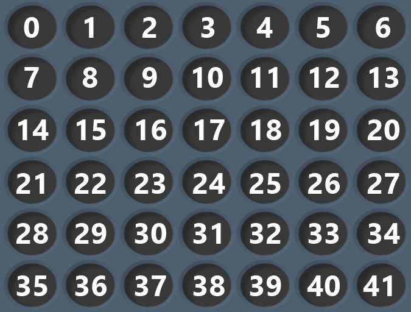

## Connect 4
Game play can be seen at [Wikipedia](https://en.wikipedia.org/wiki/Connect_Four).
### Messages to receive
These messages must be handled by the Bot:

```
 Name         | Type   | Description 
 -----------------------------------
 Move request | string | 42 integers separated by space ( ) defining the current board position. After “Board position” has been received, the Bot has to send a “Next move” command.
 Game over    | string | "GameOver"
```

#### Message: Move request
This message will be sent to your local Bot containing the current board position. The board position is represented by a 6 by 7 matrix where every cell has one of the following states:
- 1  = Your playing piece
- 0  = Empty square
- -1 = Opponent playing piece
Note: This means that whether you are currently playing as Red or Yellow, your pieces will always be 1 and your opponents -1. 

The board matrix will be sent to you in a plain text message containing 42 numbers all separated by one space. These numbers will be written column by column as you can see below.



As an example, the string `"0 0 0 0 0 0 0 0 0 0 0 0 0 0 0 0 0 1 0 0 0 0 0 0 -1 0 0 0 0 0 -1 1 0 0 0 0 0 -1 1 0 0 0"` 
yields the following board (assuming you are yellow; for red all `1`s and `-1`s would be interchanged):


#### Message: Game over
Self explanatory. Contains the exact message `“GameOver”`, and indicates that the game is over.

### Messages to send
These messages must be sent by the Bot:

```
 Name        | Type   | Description
 ----------------------------------
 Player move | string | One (1) number between 0-6 indicating the next move. Sent after a Move request message has been received.
```

#### Message: Player move
This is the message that you send containing information about what move you wish to make. You simply send a text message referring to what column you chose to drop your next piece in. The columns are zero indexed, meaning you are expected to send a message from 0-6.


If Albot.Online for whatever reason does not accept your move it will resend the move request until you give a proper response.

